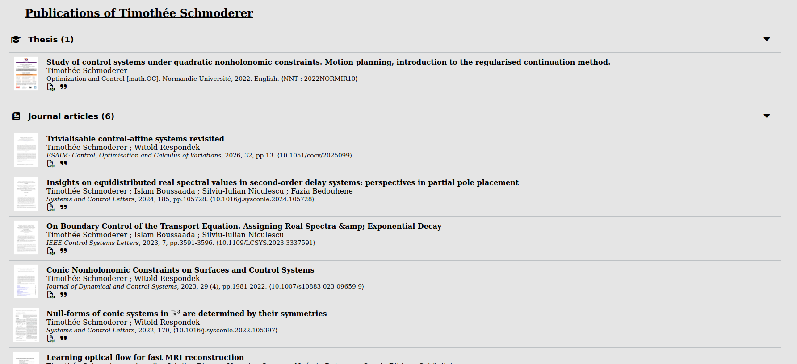
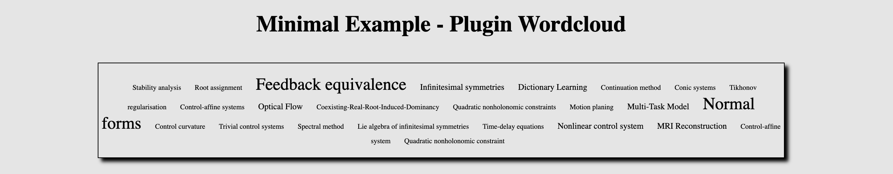

# Intégrateur de bibliographie HAL <a name="top"></a>
[](https://github.com/tschmoderer/hal-bibliography-integrator/actions/workflows/build.yml)
[](https://github.com/tschmoderer/hal-bibliography-integrator/actions/workflows/docs.yml)
[](https://github.com/tschmoderer/hal-bibliography-integrator/releases)
[](https://github.com/tschmoderer/hal-bibliography-integrator/blob/main/LICENSE)

Ce dépôt contient un module JavaScript qui facilite l'intégration de la **bibliographie** HAL d'un auteur ou d'une auteure dans un site web. Le code utilise l'[API HAL](https://api.archives-ouvertes.fr/docs) pour récupérer les données et les présente dans un style similaire à celui du [CV HAL](https://cv.hal.science/). Le package propose également plusieurs plugins pour enrichir les informations affichées.

[](https://tschmoderer.github.io/hal-bibliography-integrator/)
[](https://tschmoderer.github.io/hal-bibliography-integrator/pages/demo.html)


- [Intégrateur de bibliographie HAL](#top)
  * [Tutoriel](#tutoriel)
    + [Liste des types de publications HAL pris en charge](#typeList)
    + [Ajouter le support de nouveaux types](#addTypeList)
    + [Limitations](#limitations)
  * [Plugins](#plugins)
    + [Nuage de mots clés](#wordcloud)
    + [Métriques liées aux articles](#artscore)

## Tutoriel<a name="tutoriel"></a>

Pour intégrer une bibliographie HAL dans un site munissez vous de l'[idHal](https://doc.archives-ouvertes.fr/identifiant-auteur-idhal-cv/) du chercheur ou de la chercheuse concerné(e).

0. Téléchargez la dernière [release](https://github.com/tschmoderer/hal-bibliography-integrator/releases) et extrayer les fichiers *hal.js* et *hal.css* depuis le fichier "dist.zip".

1. A l'endroit où vous souhaitez intégrer la bibliographie insérez le nœud HTML suivant 

   ```html
   <div id="hal-bibliography-integrator"></div>
   ```

2. Dans le `<head>` de votre page, insérez le code suivant pour charger les ressources CSS :

   ```html
   <link rel="stylesheet" href="https://cdnjs.cloudflare.com/ajax/libs/font-awesome/6.3.0/css/all.min.css" integrity="sha512-SzlrxWUlpfuzQ+pcUCosxcglQRNAq/DZjVsC0lE40xsADsfeQoEypE+enwcOiGjk/bSuGGKHEyjSoQ1zVisanQ==" crossorigin="anonymous" referrerpolicy="no-referrer" />
   <link rel="stylesheet" href="./path/to/hal.css">
   ```

3. (*Optionnel*) Si certain titres d'articles contiennent des expressions mathématiques, pour qu'il soient correctement formatés, ajoutez dans le `<head>` de votre page le code suivant

   ```html
   <script>
       MathJax = {
           tex: {
               inlineMath: [['$', '$'], ['\\(', '\\)']],
               processEscapes: true,
               tags: "all"
           },
           svg: {
               fontCache: 'global'
           },
           loader: {
               load: ['[tex]/html']
           }
       };
   </script>
   <script src="https://cdnjs.cloudflare.com/ajax/libs/mathjax/3.2.2/es5/tex-svg.min.js" integrity="sha512-EtUjpk/hY3NXp8vfrPUJWhepp1ZbgSI10DKPzfd+3J/p2Wo89JRBvQIdk3Q83qAEhKOiFOsYfhqFnOEv23L+dA==" crossorigin="anonymous" referrerpolicy="no-referrer"></script>
   ```

4. A la fin du `<head>` de votre page HTML, ajoutez le code suivant en configurant l'idHal cible et la liste des types de publications souhaitées (voir la liste des types pris en charge ci-dessous). La clé 'debug' permet d'afficher certaines informations du script dans la console du navigateur. 

   ```html
   <script type="text/javascript">
       const hal_integrator_config = {
          // idHal personnalisé
          "id": "timothee-schmoderer",
          // Liste des types de publications souhaités
          "typeList": ["THESE", "ART", "UNDEFINED", "COMM"],
          // (Optionnel: activation manuelle)
          "doit": false,
          // (Optionnel: mode de débogage)
          "debug": false,
        }
   </script>
   ```

*Remarque* : Les différentes sections de publications apparaissent dans l'ordre défini par le tableau de la clé *typeList*.

5. A la fin du `<body>` de votre page HTML, ajoutez la code suivant pour charger le script 


   ```html
    <script type="text/javascript" src="./path/to/hal.js"></script>
   ```



### Liste des types de publications HAL pris en charge<a name="typelist"></a>

Le tableau suivant donne les keywords a utiliser dans la clé *typeList* pour obtenir la liste complète des publications de ce type. La dernière colonne indique si le type est pris en charge par le module javascript: 

| Keyword     | Description | Pris en charge | Icon |
| :---------: | ----------- | :------------: | :------------: |
| ART         | Article de journal | :heavy_check_mark: |  |
| COMM        | Communication dans un congrès | :heavy_check_mark: |  |
| COUV        | Chapitre de livre | :heavy_check_mark: |  |
| THESE       | Thèse | :heavy_check_mark: |  |
| OUV         | Livre | :heavy_check_mark: |  |
| UNDEFINED   | Preprint, document de travail | :heavy_check_mark: |  |
| REPORT      | ? | :x: |  |
| OTHER       | ? | :x: |  |
| MEM         | ? | :x: |  |
| IMG         | Image | :x: |  |
| POSTER      | Poster de conférence |  :heavy_check_mark: |  |
| ISSUE       | ? | :x: |  |
| PROCEEDINGS | Proceedings | :heavy_check_mark: |  |
| HDR         | Habilitation à diriger des recherche | :x: |  |
| NOTICE      | ? | :x: |  |
| PATENT      | Brevet | :heavy_check_mark: |  |
| BLOG        | ? | :x: |  |
| REPORT_LABO | ? | :x: |  |
| VIDEO       | Vidéo | :x: |  |
| REPORT_MAST | ? | :x: |  |
| LECTURE     | Cours | :heavy_check_mark: |  |
| REPORT_LPRO | ? | :x: |  |
| REPORT_LICE | ? | :x: |  |
| TRAD        | ? | :x: |  |
| SOFTWARE    | Logiciel | :heavy_check_mark: |  |
| CREPORT     | ? | :x: |  |
| PRESCONF    | ? | :x: |  |
| REPORT_DOCT | ? | :x: |  |
| REPORT_ETAB | ? | :x: |  |
| MAP | ? | :x: |  |
| SON | ? | :x: |  |
| REPORT_FORM | ? | :x: |  |
| REPORT_GMAST | ? | :x: |  |
| OTHERREPORT | ? | :x: |  |
| NOTE | ? | :x: |  |
| SYNTHESE | ? | :x: |  |
| REPORT_FPROJ | ? | :x: |  |
| REPORT_GLICE | ? | :x: |  |
| REPACT | ? | :x: |  |
| MEMLIC | ? | :x: |  |
| REPORT_RFOINT | ? | :x: |  |
| REPORT_COOR | ? | :x: |  |
| ETABTHESE | ? | :x: |  |
| REPORT_RETABINT | ? | :x: |  |
| MANUAL | ? | :x: |  |
| DOUV | ? | :x: |  |

### Ajouter le support de nouveaux types<a name="addTypeList"></a>

Pour ajouter le support d'un nouveau type de publication, suivez les étapes ci-dessous :

1. Clonez ce dépôt git. 
2. Ouvrez le fichier *hal-utils.js* dans le dossier local du dépôt.
3. Dans la variable *hal_helpers*, ajoutez une nouvelle entrée pour le nouveau type de publication :

```json
{
   "TYPE": {
       "icon": "classe de l'icône",
       "title_en": "titre de la section pour ce type de publication"
   }
}
```

Assurez-vous de remplacer "TYPE" par le mot-clé correspondant au nouveau type de publications. Spécifiez la classe de l'icône associée au type en utilisant une icône mise à disposition par [Font Awesome](https://fontawesome.com/icons). Fournissez également le titre de la section en anglais pour ce type de publications.

4. Modifiez le fichier *README.md* en ajoutant dans le tableau ci-dessus le nouveau type pris en charge. 
5. Une fois que vous avez effectué les modifications, vous pouvez partager votre contribution en créant une pull request sur ce dépôt ou en envoyant la nouvelle version par e-mail à [T. Schmoderer](mailto:timothee.schmoderer@insa-rouen.fr).

## Limitations

- Une seule section de publications, par page où le script *hal.js* est chargé, est permise. 

## Plugins<a name="plugins"></a>

Ce package propose l'ajout de plugins pour étendre les fonctionnalités du module. L'exécution des plugins est automatique a partir du moment ou les scripts *hal.js* et *hal-[plugin-name].js* sont présents. Les plugins sont configurables a travers le dictionaire contenu dans la clé "plugins" de la variable *hal_integrator_config* : 

   ```html
   <script type="text/javascript">
       const hal_integrator_config = {
           ...
          "plugins": {
            "plugin-name": {},
          }
        }
   </script>
   ```
Voir la [documentation](https://tschmoderer.github.io/hal-bibliography-integrator/) pour le détail des options de configuration de chaque plugin. 

### Nuage de mots clés<a name="wordcloud"></a>

Le plugin **wordcloud** permet d'intégrer un nuage de mots-clés associés à un auteur. Les mots-clés sont extraits des publications affichées par le module principal. Ainsi, pour utiliser ce plugin, il est nécessaire de suivre la procédure décrite dans le tutoriel ci-dessus pour intégrer le module principal. Néanmoins, si vous souhaitez afficher uniquement le nuage de mots sans les publications, vous pouvez simplement ajouter le style suivant :

```html
<style>
  #hal-bibliography-integrator {display: none;}
<style>
```



Pour intégrer le nuage de mots-clés de l'auteur dans votre page, suivez les étapes suivantes :

1. À l'endroit où vous souhaitez afficher le nuage de mots-clés, insérez le nœud HTML suivant :

```html
<div id="hal-wordcloud-integrator"></div>
```

2. Dans la section `<head>` de votre page, ajoutez le lien vers la feuille de styles spécifique au nuage de mots-clés. Assurez-vous de spécifier le chemin d'accès correct vers le fichier `hal-wordcloud.css` :

```html
<link rel="stylesheet" href="./path/to/hal-wordcloud.css">
```

3. À la fin de la section `<body>` de votre page, ajoutez le script suivant pour charger le fichier `hal-wordcloud.js`. Assurez-vous également de spécifier le chemin d'accès correct vers le fichier :

```html
<script type="text/javascript" src="./path/to/hal-wordcloud.js"></script>
```


### Métriques liées aux articles<a name="artscore"></a>

Le plugin **artscore** (article score) ajoute des métriques aux publications de type *ART* (articles de journaux). Le plugin récupère des métriques du journal ([SJR](https://www.scimagojr.com/journalrank.php), [quartile](https://www.scimagojr.com/journalrank.php), [h-index](https://www.scimagojr.com/journalrank.php), [CiteScore](https://www.scopus.com/sources)) ainsi que le nombre de citations d'après [semantic scholar](https://www.semanticscholar.org/).


Pour activer le plugin, veuillez suivre les étapes suivantes :

1. Assurez-vous d'avoir ajouté le module principal **hal.js** à votre site web en suivant les instructions du [tutoriel](#tutoriel).
2. Dans la section `<head>` de votre page, ajoutez le lien vers la feuille de styles :

```html
    <link rel="stylesheet" href="./path/to/hal-artscore.css">
```

3. Pour récupérer les infos de [scopus](https://www.scopus.com/sources) (pour obtenir la métrique CiteScore du journal) procurez-vous une clé d'API à ce [lien](https://dev.elsevier.com/) puis configurez le plugin via la variable : 

```html
<script type="text/javascript">
const hal_integrator_config = {
           ...
          "plugins": {
             "artscore": {
                "scopus": {
                    "apiKey": "your-api-key",
                }
              }
          }
        }
</script>
```

5. A la fin de la section `<body>`, ajoutez le lien vers le script du plugin : 
```html
    <script type="text/javascript" src="./path/to/hal-artscore.js"></script>
```

**Warnings**: 
- Seulement les éléments de type "ART" (article de journaux) sont traités.
- Un certain nombre de problèmes liés à des données non trouvées peuvent être résolus en configurant manuellement le plugin, voir la [documentation](https://tschmoderer.github.io/hal-bibliography-integrator/). 
