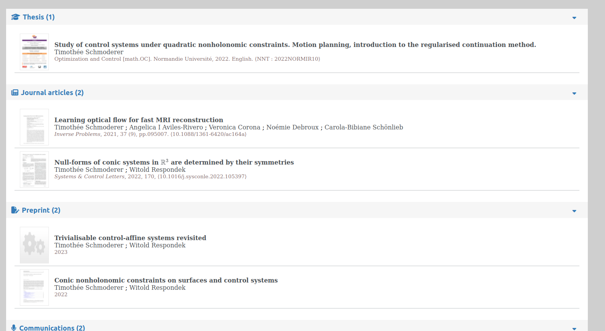

# Liste publications HAL


Ce dépôt contient une page web minimale qui permet d'intégrer facilement une bibliographie HAL dans un site web. Le code utilise l'API HAL pour récupérer les données puis les présentent avec style imitant celui du CV HAL.

- [Sommaire](#liste-publications-hal)
  * [Aperçu du résultat](#resultat)
  * [Tutoriel](#tutoriel)
  * [Liste des types de publications HAL](#liste-des-types-de-publications-hal)
  * [Ajouter le support de nouveaux types](#ajouter-le-support-de-nouveaux-types)
  * [Limitations](#limitations)

## Aperçu du résultat<a name="resultat"></a>



## Tutoriel

Pour intégrer une bibliographie HAL dans un site munissez vous de l'[idHal](https://doc.archives-ouvertes.fr/identifiant-auteur-idhal-cv/) du chercheur(se) en question et téléchargez les fichiers de ce dépôt git. 

1. A l'endroit où vous souhaitez intégrer la bibliographie insérez le nœud HTML suivant 

   ```html
   <div id="publi-hal-all"></div>
   ```

2. Dans le <head> de votre page, insérez le code suivant 

   ```html
   <link rel="stylesheet" href="https://cdnjs.cloudflare.com/ajax/libs/font-awesome/6.3.0/css/all.min.css" integrity="sha512-SzlrxWUlpfuzQ+pcUCosxcglQRNAq/DZjVsC0lE40xsADsfeQoEypE+enwcOiGjk/bSuGGKHEyjSoQ1zVisanQ==" crossorigin="anonymous" referrerpolicy="no-referrer" />
   <link rel="stylesheet" href="hal-style.css">
   ```

   qui charge les ressources CSS;

3. (*Optionnel*) Si certain titres d'articles contiennent des maths , pour qu'il soient correctement formatés, ajoutez dans le <head> de votre page le code suivant

   ```html
   <script>
       MathJax = {
           tex: {
               inlineMath: [['$', '$'], ['\\(', '\\)']],
               processEscapes: true,
               tags: "all"
           },
           svg: {
               fontCache: 'global'
           },
           loader: {
               load: ['[tex]/html']
           }
       };
   </script>
   <script src="https://cdnjs.cloudflare.com/ajax/libs/mathjax/3.2.2/es5/tex-svg.min.js" integrity="sha512-EtUjpk/hY3NXp8vfrPUJWhepp1ZbgSI10DKPzfd+3J/p2Wo89JRBvQIdk3Q83qAEhKOiFOsYfhqFnOEv23L+dA==" crossorigin="anonymous" referrerpolicy="no-referrer"></script>
   ```

4. A la fin du <head> de votre page HTML, ajoutez le code suivant en configurant l'idHal cible et la liste des types de publications souhaitées (voir plus bas pour les types pris en charge)

   ```html
   <script type="text/javascript">
       // idHal personalisé
       const idhal = "custom-idhal";
       // Liste des keywords de type de publications souhaitées
       const publiList = ["THESE", "ART", "UNDEFINED", "COMM"]
   </script>
   ```

*NB*: Les différentes sections de publications apparaissent dans l'ordre de la liste définies dans la variable *publiList*.

## Liste des types de publications HAL

Le tableau suivant donne les keywords a utiliser dans la variable *publiList* pour obtenir. La dernière colonne indique si le type est pris en charge: 

| Keyword     | Description | Pris en charge |
| :---------: | ----------- | :------------: |
| ART         | Article de journal | :heavy_check_mark: |
| COMM        | Communication dans un congrès | :heavy_check_mark: |
| COUV        | ? | :x: |
| THESE       | Thèse | :heavy_check_mark: |
| OUV         | ? | :x: |
| UNDEFINED   | Preprint, document de travail | :heavy_check_mark: |
| REPORT      | ? | :x: |
| OTHER       | ? | :x: |
| MEM         | ? | :x: |
| IMG         | Image | :x: |
| POSTER      | ? | :x: |
| ISSUE       | ? | :x: |
| PROCEEDINGS | ? | :x: |
| HDR         | Habilitation à diriger des recherche | :x: |
| NOTICE      | ? | :x: |
| PATENT      | Brevet | :x: |
| BLOG        | ? | :x: |
| REPORT_LABO | ? | :x: |
| VIDEO       | Vidéo | :x: |
| REPORT_MAST | ? | :x: |
| LECTURE     | ? | :x: |
| REPORT_LPRO | ? | :x: |
| REPORT_LICE | ? | :x: |
| TRAD        | ? | :x: |
| SOFTWARE    | Logiciel | :x: |
| CREPORT     | ? | :x: |
| PRESCONF    | ? | :x: |
| REPORT_DOCT | ? | :x: |
| REPORT_ETAB | ? | :x: |
| MAP | ? | :x: |
| SON | ? | :x: |
| REPORT_FORM | ? | :x: |
| REPORT_GMAST | ? | :x: |
| OTHERREPORT | ? | :x: |
| NOTE | ? | :x: |
| SYNTHESE | ? | :x: |
| REPORT_FPROJ | ? | :x: |
| REPORT_GLICE | ? | :x: |
| REPACT | ? | :x: |
| MEMLIC | ? | :x: |
| REPORT_RFOINT | ? | :x: |
| REPORT_COOR | ? | :x: |
| ETABTHESE | ? | :x: |
| REPORT_RETABINT | ? | :x: |
| MANUAL | ? | :x: |
| DOUV | ? | :x: |

## Ajouter le support de nouveaux types

Dans le fichier *hal-script.js* complétez la variable *hal_helpers* avec un nouveau type de publication : 

```json
{
   "TYPE": {
       "icon": "icon class",
       "title_en": "titre de la section pour ce type de publication"
   }
}
```

Les icônes doivent être dans la liste des icônes gratuites de [fontawesome](https://fontawesome.com/icons). Merci de partager votre contribution soit en créant un pull-request sur ce dépôt, soit en envoyant votre nouvelle version par mail à [T. Schmoderer](mailto:timothee.schmoderer@insa-rouen.fr).

## Limitations

- Une seule section de publication par page est permise. 
