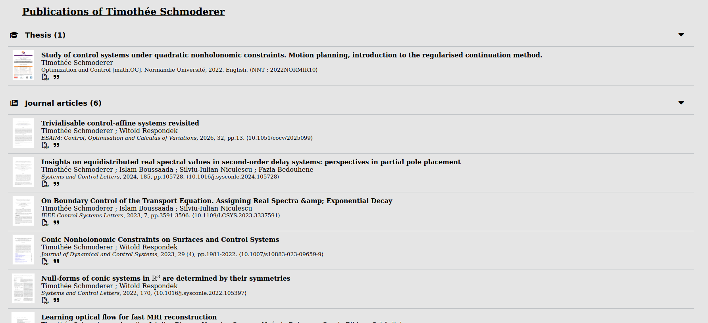

# HAL Bibliography Integrator <a name="top"></a>
[](https://github.com/tschmoderer/hal-bibliography-integrator/actions/workflows/build.yml)
[](https://github.com/tschmoderer/hal-bibliography-integrator/actions/workflows/docs.yml)
[](https://github.com/tschmoderer/hal-bibliography-integrator/releases)
[](https://github.com/tschmoderer/hal-bibliography-integrator/blob/main/LICENSE)
[](https://github.com/tschmoderer/hal-bibliography-integrator/wiki)
[](https://tschmoderer.github.io/hal-bibliography-integrator/pages/demo.html)

This repository contains a JavaScript module that simplifies the integration of an author's **HAL bibliography** into a website. The code uses the [HAL API](https://api.archives-ouvertes.fr/docs) to retrieve data and displays it in a style similar to the [HAL CV](https://cv.hal.science/). The package also provides several plugins to enhance the displayed information.

## Tutorial <a name="tutorial"></a>

To integrate a HAL bibliography into a website, you will need the researcher's HAL unique identifier: [idHal](https://doc.archives-ouvertes.fr/identifiant-auteur-idhal-cv/).

0. Download the latest [release](https://github.com/tschmoderer/hal-bibliography-integrator/releases) and extract the *hal.js* and *hal.css* files from the "dist.zip" archive.

1. Insert the following HTML node where you want to display the bibliography:

   ```html
   <div id="hal-bibliography-integrator"></div>
   ```

2. In the `<head>` of your page, add the following code to load the CSS resources:

   ```html
   <link rel="stylesheet" href="https://cdnjs.cloudflare.com/ajax/libs/font-awesome/6.3.0/css/all.min.css" integrity="sha512-SzlrxWUlpfuzQ+pcUCosxcglQRNAq/DZjVsC0lE40xsADsfeQoEypE+enwcOiGjk/bSuGGKHEyjSoQ1zVisanQ==" crossorigin="anonymous" referrerpolicy="no-referrer" />
   <link rel="stylesheet" href="./path/to/hal.css">
   ```

3. (*Optional*) If some article titles contain mathematical expressions, you can ensure proper rendering by adding the following code to the `<head>` of your page:

   ```html
   <script>
       MathJax = {
           tex: {
               inlineMath: [['$', '$'], ['\\(', '\\)']],
               processEscapes: true,
               tags: "all"
           },
           svg: {
               fontCache: 'global'
           },
           loader: {
               load: ['[tex]/html']
           }
       };
   </script>
   <script src="https://cdnjs.cloudflare.com/ajax/libs/mathjax/3.2.2/es5/tex-svg.min.js" integrity="sha512-EtUjpk/hY3NXp8vfrPUJWhepp1ZbgSI10DKPzfd+3J/p2Wo89JRBvQIdk3Q83qAEhKOiFOsYfhqFnOEv23L+dA==" crossorigin="anonymous" referrerpolicy="no-referrer"></script>
   ```

4. At the end of the `<head>` section of your HTML page, add the following code and configure the target **idHal** and the list of desired publication types (see the supported types list below). The debug key enables additional logs in the browser console.
   ```html
   <script type="text/javascript">
       const hal_integrator_config = {
            // Custom idHal
            "id": "timothee-schmoderer",
            // List of desired publication types
            "typeList": ["THESE", "ART", "UNDEFINED", "COMM"],
            // (Optional: manual trigger)
            "doit": false,
            // (Optional: debug mode)
            "debug": false,
        }
   </script>
   ```
    *Note*: The different publication sections are displayed in the order defined in the *typeList* array.

5. At the end of the `<body`> of your HTML page, add the following code to load the script:

   ```html
   <script type="text/javascript" src="./path/to/hal.js"></script>
   ```



## Copyright
